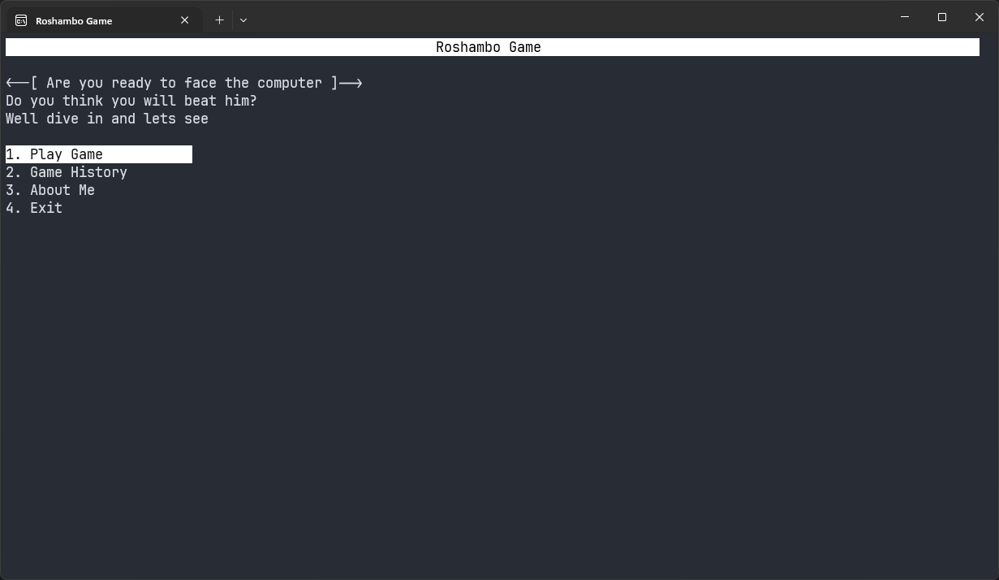
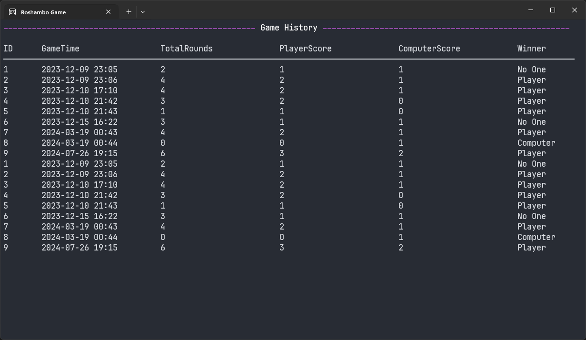
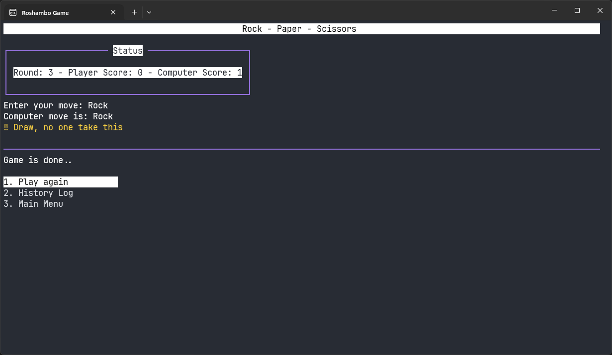

# Roshambo Game

## Description
The Roshambo Game is a console-based Rock-Paper-Scissors game written in C#. It was developed as a learning exercise while I was a beginner in C# programming. The game features cool widgets and animations thanks to the TConsole library, which provides animations, menus, prompts, text styles, and more.

## Features
- **Play Game:** Users can play Rock-Paper-Scissors against the computer.
- **Game History:** The game saves all played games and displays a history log.
- **Animations and Widgets:** Utilizes the TConsole library for enhanced console UI, including animations and styled text.

## User Interaction
Users interact with the application through the console by selecting options from the menu. The following actions are available:
- **Play Game:** Start a new game of Rock-Paper-Scissors against the computer.
- **Game History:** View the history of all played games, including scores and winners.
- **About Me:** Display information about the developer.
- **Exit:** Quit the application.

## Technologies Used
- **Programming Language:** C#
- **Environment:** Console Application
- **Library:** [TConsole](https://www.nuget.org/packages/TConsole)

## Getting Started
To get started with the Roshambo Game, follow these steps:
1. Clone the repository to your local machine.
2. Open the solution file in Visual Studio.
3. Build and run the application.
4. Follow the on-screen instructions to play the game.

## Screenshots

## Future Improvements
- Add more variations of the game, such as additional hand signs.
- Implement a multiplayer mode.
- Enhance the history log with more detailed statistics.

## Contributing
If you would like to contribute to this project, please fork the repository and submit a pull request.

## License
This project is licensed under the MIT License.
